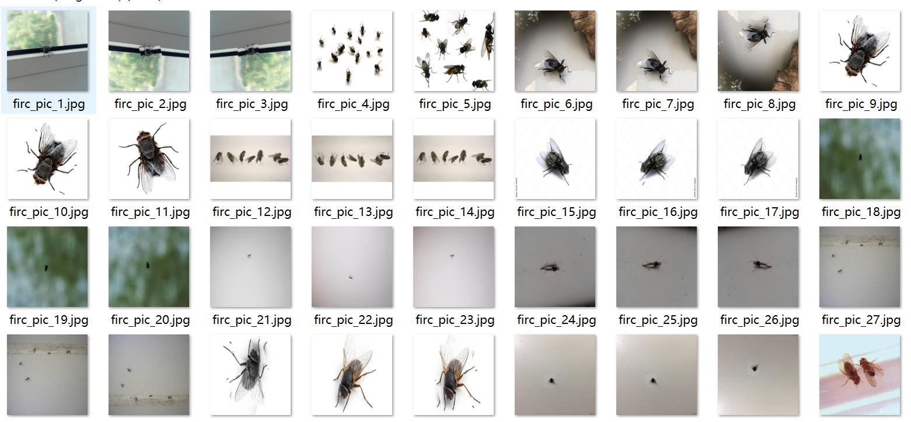
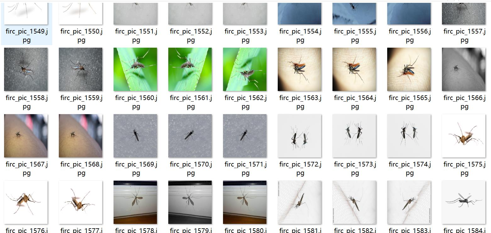
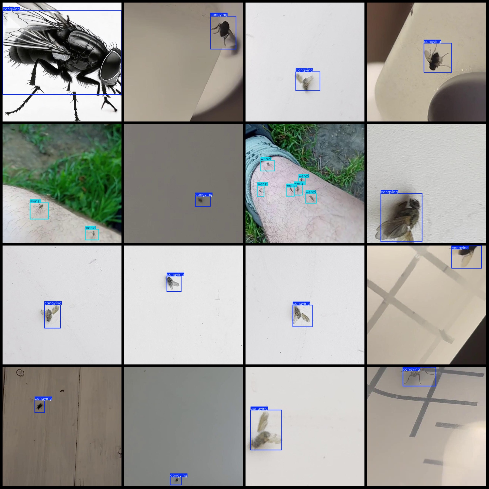
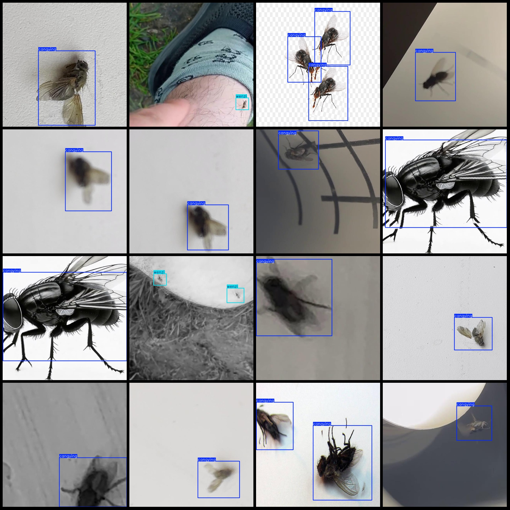

# Flying Insects and Mosquito Detection Dataset (VOC+YOLO) - 5339 Images in 2-class with Enhanced Data

Please note that approximately one-third of the dataset consists of original images, while the remaining is enhanced images.
Dataset format: Pascal VOC format + YOLO format (txt file without split paths, only contains jpg images and corresponding VOC format xml files and yolo format txt files)
number of images: 5339  
annotation count: 5339  
annotation count: 5339  
annotationnumber of classes: 2  
["cangying","wenzi"]
Number of boxes labeled in each category:
The number of cangying (or fly) boxes counted in the VOC dataset is 5252.
Wenzi is a Chinese word meaning "mosquito". The number 1881 is not related to the word "Wenzi" or "Mosquito".
total boxes: 7133  
Number of images per category:
cangying images = 4586  
Wenzi has 756 pictures.
image resolution: 640x640  
Use annotation tool: labelImg
Annotation rule: draw a rectangle around the class
Important notes: dataset does not have a split into training, validation, and test sets.
Special Notice: This dataset does not guarantee the accuracy of the trained model or weight files.
Image Preview: 
Annotation Example:
## Images

Here is a pay link on Stripe ( https://buy.stripe.com/3cs8yP7sY87d0vu9AB ). Please contact me lonlonago@foxmail.com after funding $89, and I will send you a complete data files , thank you!

